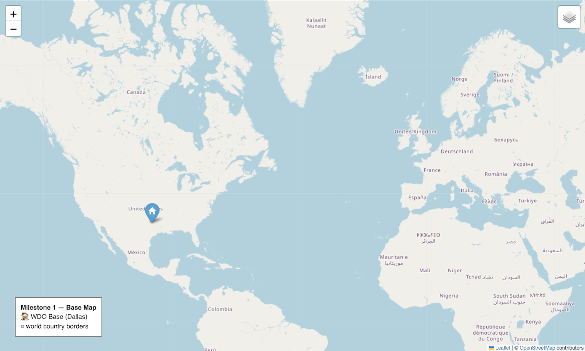
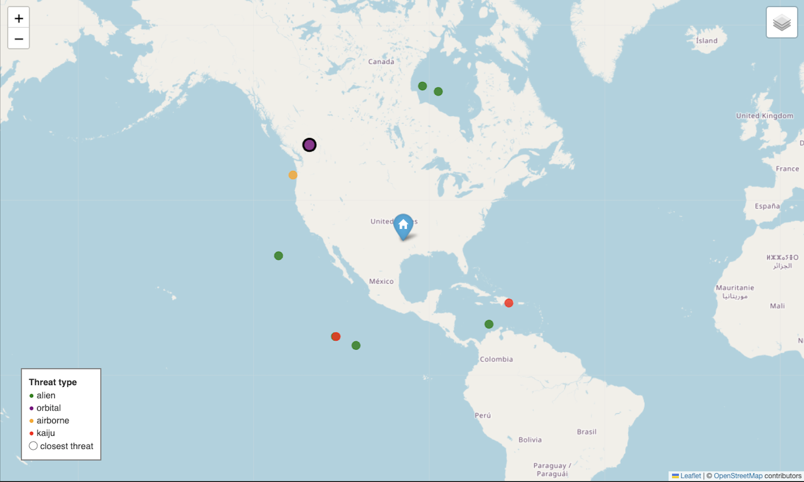
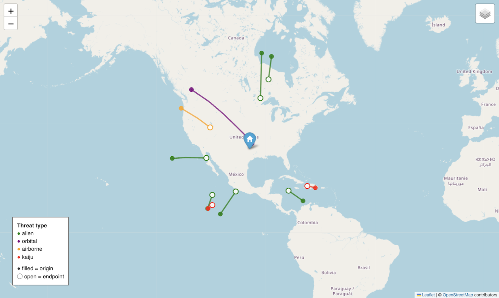
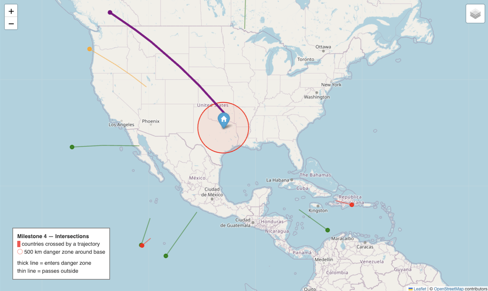
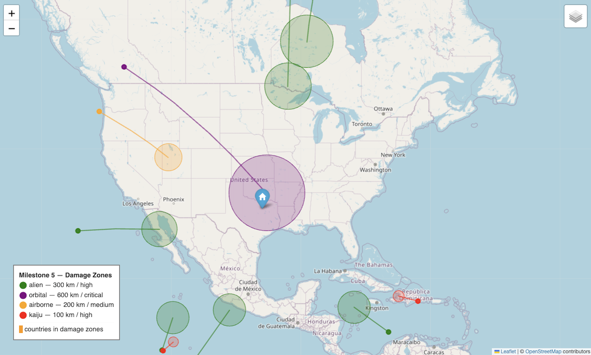

# Project 01 — Missile Geometry 101

**Course:** Spatial Data & Mapping
**Analyst:** *(Aakash Harolia)*
**Base Location:** Dallas, TX (32.7767, -96.7970)

---

## Mission

I am a Spatial Defense Analyst at the **World Defense Organization (WDO)**.
Earth is under threat from non-human entities (alien craft, orbital weapons,
high-altitude airborne platforms, and kaiju-class ground threats).

My job is **not** to fire weapons. My job is to **trust geometry** — to figure
out where threats come from, where they are going, what they intersect, and
who is in danger.

---

## What's in this folder

```
Project_01/
├── notebook.ipynb              # Main analysis notebook (all milestones)
├── README.md                   # This file
├── src/wdo/                    # Toolkit (haversine, bearing, viz, IO)
│   ├── __init__.py
│   ├── geo_math.py             # distance, bearing, destination, trajectories
│   ├── io_shapefile.py         # read shapefiles into GeoJSON-like dicts
│   └── viz_map.py              # Folium helpers for maps
├── data/
│   ├── world_borders/          # World countries shapefile
│   └── threats/threats.json    # Simulated incoming threats
├── maps/                       # Saved HTML maps (one per milestone)
└── screenshots/                # PNG screenshots embedded below
```

---

## How to run

1. Open notebook.ipynb in VS Code.
2. Pick the .venv Python kernel.
3. Click Run All.

Generated maps land in maps/. Screenshots go in screenshots/.

---

## Milestones

### 1 — Plot the World
Loaded world borders shapefile, plotted with Folium, added base marker.



### 2 — Distance & Bearing
Haversine distance + bearing from each threat to base. Closest threat highlighted.



### 3 — Trajectories
Turned each threat into a path using bearing + speed + duration.



### 4 — Intersections & Borders
Used Shapely `intersects()` to find which countries each trajectory crosses. Added a 500 km danger zone around the base.



### 5 — Damage Zones
Buffered each trajectory endpoint by threat type (kaiju 100 km, airborne 200, alien 300, orbital 600).




---

## Reflection

**Surprised me:** How much time went into setup (venv, kernels, paths) before any geometry actually ran.

**Broke:** File was named `wdo_geo.py` but imports expected `geo_math.py`. Folium wouldn't install without a venv. `destination_point` returned a dataclass instead of a tuple and crashed `trajectory_points`. VS Code blocked maps from rendering until I trusted the notebook.

**Clicked:** A trajectory is just a list of points. And almost every spatial question is the same `intersects()` check applied differently.

---


